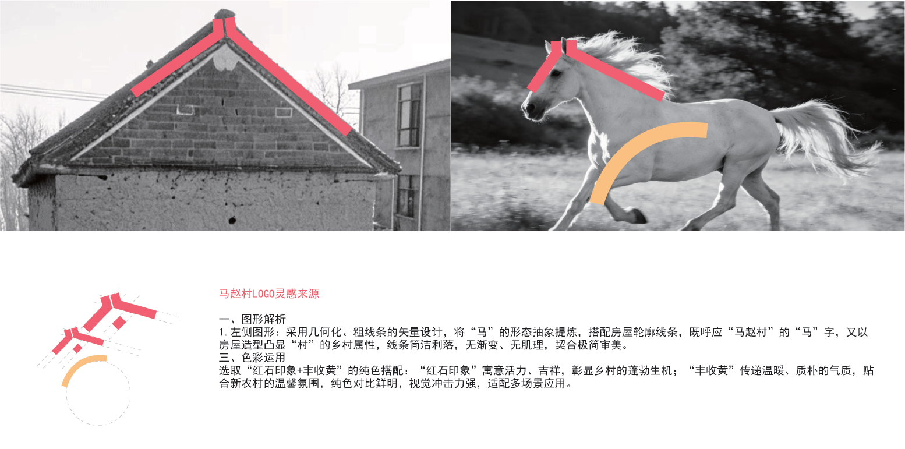
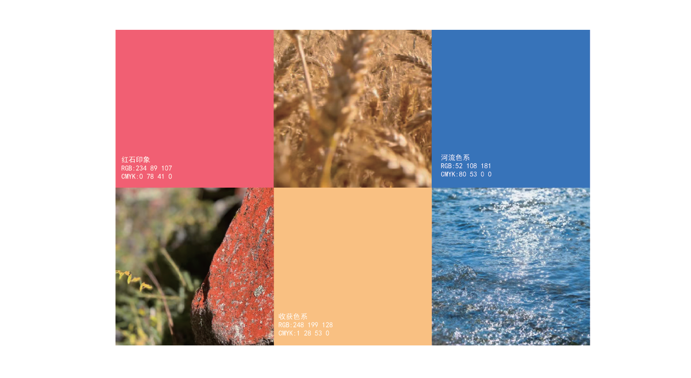
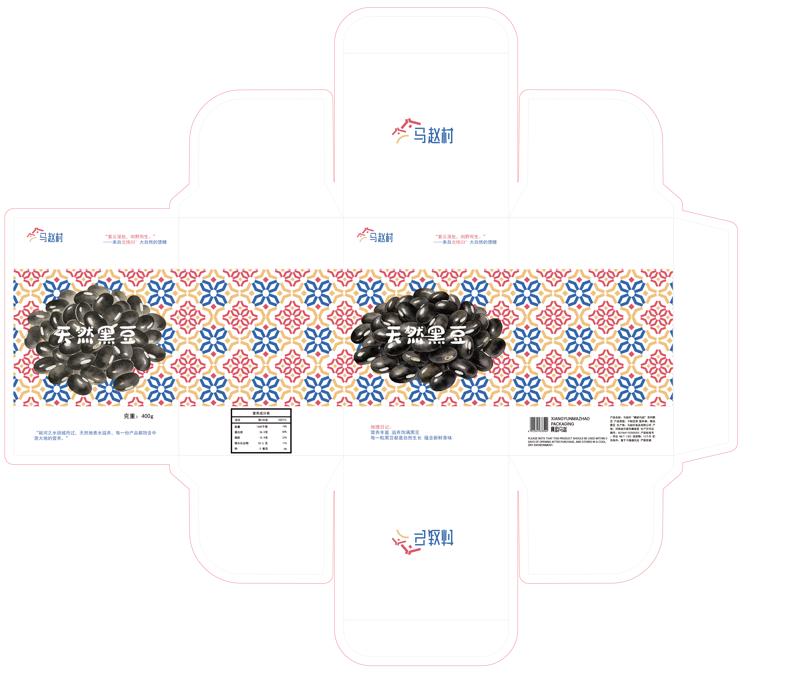

# 襄韵马赵 — 毕业设计作品 H5 展示页面

> **扫码访问**：见项目目录 `website-qr.png`

---

## 目录

- [项目简介](#项目简介)
- [文件结构](#文件结构)
- [HTML/CSS/JS 基础知识](#htmlcssjs-基础知识)
- [index.html 逐行拆解](#indexhtml-逐行拆解)
- [styles.css 逐段拆解](#stylescss-逐段拆解)
- [script.js 逐段拆解](#scriptjs-逐段拆解)
- [文件之间如何协作](#文件之间如何协作)
- [配色方案](#配色方案)
- [响应式设计](#响应式设计)
- [如何使用 Git 和 GitHub](#如何使用-git-和-github)
- [如何部署上线](#如何部署上线)

---

## 项目简介

这是一个**静态网页**，用于展示「襄韵马赵」品牌毕业设计作品。页面包含五个区域：

| 区域 | 内容 |
|------|------|
| 头部导航 | 固定顶部，点击跳转到对应模块 |
| 概览区（Hero） | 双图轮播 + 品牌标语淡入动画 |
| 品牌形象设计 | PDF 品牌手册在线翻页阅读 |
| 广告设计 | 静态海报 + 动态海报视频切换 |
| 包装设计 | 9 个分支模块的图片网格 + 点击放大 |
| 文创设计 | 文创产品图片网格 + 点击放大 |

核心技术：**HTML**（结构）+ **CSS**（样式）+ **JavaScript**（交互）+ **PDF.js**（PDF 渲染）。

---

## 文件结构

```
01/
├── index.html          ← 网页主文件（HTML 结构）
├── styles.css          ← 样式文件（CSS 外观）
├── script.js           ← 脚本文件（JS 交互逻辑）
├── js/                 ← PDF.js 本地库（零 CDN 依赖）
│   ├── pdf.min.js      ← PDF.js 核心库
│   └── pdf.worker.min.js ← PDF.js 后台渲染线程
├── 素材/                 ← 资源文件夹（图片/视频/PDF）
│   ├── 海报/           ← 静态海报图 & 动态海报视频
│   │   ├── 海报1~3.jpg
│   │   └── 动态1~3.mp4
│   ├── 品牌形象设计/   ← 品牌主视觉图 & 手册 PDF
│   ├── 平面图/         ← 包装设计 PNG 图片
│   ├── 渲染图/         ← 产品渲染 JPG 图片
│   ├── 文创设计/       ← 文创产品展示图
│   └── 实物图/         ← 产品实物照片
├── .gitignore          ← Git 忽略规则
└── README.md           ← 本说明文档
```

---

## HTML/CSS/JS 基础知识

### 三者关系（用盖房子类比）

```
HTML  = 房子的骨架（墙、门、窗的位置）
CSS   = 房子的装修（颜色、大小、间距）
JS    = 房子的电路（开关灯、自动门）
```

### HTML 是什么

HTML（HyperText Markup Language，超文本标记语言）由**标签**组成：

```html
<p>这是一段文字</p>          <!-- p = paragraph 段落 -->
       <!-- img = image 图片，自闭合标签 -->
<div>这是一个容器</div>       <!-- div = division 块级容器 -->
<a href="#section1">链接</a> <!-- a = anchor 超链接 -->
```

标签可以有**属性**：`src`（图片路径）、`href`（链接地址）、`class`（样式类名）、`id`（唯一标识）。

### CSS 是什么

CSS（Cascading Style Sheets，层叠样式表）控制外观：

```css
选择器 {
  属性: 值;
}
/* 例如：让所有段落变成蓝色 */
p {
  color: blue;
  font-size: 16px;
}
```

### JS 是什么

JavaScript 让网页「动起来」：

```javascript
// 找到按钮，点击时弹出提示
document.getElementById('myBtn').addEventListener('click', function() {
  alert('你点击了按钮！');
});
```

---

## index.html 逐行拆解

### 第 1-2 行：文档类型和语言

```html
<!DOCTYPE html>                                 <!-- 声明这是 HTML5 文档，必须放在第一行 -->
<html lang="zh-CN">                             <!-- lang="zh-CN" = 页面语言是简体中文，帮助搜索引擎和屏幕阅读器 -->
```

### 第 3-9 行：`<head>` 头部（不可见元信息）

```html
<head>                                          <!-- head 内的内容不显示在页面上 -->
  <meta charset="UTF-8" />                      <!-- 字符编码 UTF-8，让中文正常显示 -->
  <meta name="viewport"                         <!-- viewport 控制手机端缩放行为 -->
        content="width=device-width,            <!-- 宽度=设备屏幕宽度 -->
                 initial-scale=1.0,             <!-- 初始缩放比例 1:1（不缩放） -->
                 maximum-scale=5.0" />          <!-- 允许用户手动放大到 5 倍 -->
  <meta name="description"                      <!-- SEO 描述，搜索引擎搜索结果中显示 -->
        content="襄韵马赵品牌设计毕业作品展示..." />
  <title>襄韵马赵 — 张恒赵佳豪毕业设计作品展示</title>  <!-- 浏览器标签页标题 -->
  <link rel="stylesheet" href="styles.css" />   <!-- 引入外部 CSS 样式文件 -->
</head>
```

### 第 10 行：`<body>` 页面主体

```html
<body>                                          <!-- 所有可见内容都在 body 里 -->
```

### 第 11-23 行：头部导航栏

```html
<header class="site-header">                    <!-- header = 页头语义标签 -->
  <div class="header-inner">                    <!-- 内层容器，限制最大宽度并居中 -->
    <div class="header-brand">                  <!-- 品牌标题区 -->
      <h1>张恒赵佳豪毕业设计作品H5展示页面</h1>  <!-- h1 = 一级标题，页面最重要的标题 -->
    </div>
    <nav class="top-nav">                       <!-- nav = 导航语义标签 -->
      <a href="#overview">概览</a>              <!-- a = 超链接，#overview 跳到 id="overview" 的元素 -->
      <a href="#project-1">品牌形象设计</a>      <!-- href="#..." 称为锚点链接 -->
      <a href="#project-2">广告设计</a>
      <a href="#project-3">包装设计</a>
      <a href="#project-4">文创设计</a>
    </nav>
  </div>
</header>
```

**锚点链接原理**：`href="#overview"` 会跳转到页面上 `id="overview"` 的元素。JS 拦截了默认跳转，改用平滑滚动。

### 第 26-41 行：概览区（Hero）

```html
<main>                                          <!-- main = 页面主要内容区 -->
  <section class="hero-section" id="overview">  <!-- section = 内容区块，id 供锚点定位 -->
    <div class="hero-copy">                     <!-- 左侧文字区（copy = 文案） -->
      <h2 class="hero-title-anim">              <!-- h2 = 二级标题，hero-title-anim 触发 CSS 动画 -->
        襄韵马赵 好山好水好风景 好人好物好粮食 和美马赵欢迎你
      </h2>
      <p>"襄韵马赵"品牌介绍，襄城县马赵村位于中原地区腹地...</p>
    </div>

    <div class="hero-visual">                   <!-- 右侧图片区 -->
      <div class="hero-carousel" id="heroCarousel">  <!-- 轮播容器，id 供 JS 获取 -->
        
             alt="品牌主视觉"                    <!-- alt = 图片加载失败时的替代文字 -->
             class="hero-slide active" />        <!-- active 类标记当前显示的图片 -->
                       <!-- 第二张默认隐藏（没有 active 类） -->
        <button class="hero-carousel-btn"        <!-- 切换按钮 -->
                id="heroCarouselNext"            <!-- id 供 JS 获取 -->
                aria-label="下一张">             <!-- aria-label = 无障碍标签，屏幕阅读器使用 -->
          &#10095;                               <!-- HTML 实体：❯ 右箭头字符 -->
        </button>
      </div>
    </div>
  </section>
```

**轮播原理**：两张 `` 初始只有一张有 `active` 类。JS 每 4 秒把 `active` 类切换到另一张，CSS 的 `display: none/block` + 动画实现切换效果。

### 第 43-57 行：品牌形象设计（PDF 手册查看器）

```html
<section class="section-block" id="project-1">
  <div class="section-content">
    <h3>品牌形象设计</h3>                       <!-- h3 = 三级标题 -->
    <p>品牌形象设计模块展示了"襄韵马赵"品牌的整体视觉风格...</p>

    <div class="pdf-viewer" id="brandPdfViewer">  <!-- PDF 查看器容器 -->
      <div class="pdf-toolbar">                 <!-- 工具栏 -->
        <button class="pdf-btn" id="pdfPrev"    <!-- 上一页按钮 -->
                aria-label="上一页">&#10094;</button>  <!-- &#10094; = ❮ -->
        <span class="pdf-page-info" id="pdfPageInfo">1 / 81</span>  <!-- 页码显示 -->
        <button class="pdf-btn" id="pdfNext"    <!-- 下一页按钮 -->
                aria-label="下一页">&#10095;</button>  <!-- &#10095; = ❯ -->
      </div>
      <div class="pdf-container" id="pdfContainer">
        <canvas class="pdf-canvas" id="pdfCanvas"></canvas>
        <!-- canvas = HTML5 画布，PDF.js 在上面逐页绘制 PDF 内容 -->
      </div>
    </div>
  </div>
</section>
```

`<canvas>` 是 HTML5 的画布元素，PDF.js 把 PDF 的每一页像素绘制到这个画布上。

### 第 60-112 行：广告设计

```html
<section class="section-block" id="project-2">
  <!-- ===== 静态海报展示 ===== -->
  <div class="static-posters">
    <h4>静态海报展示</h4>                       <!-- h4 = 四级标题 -->
    <div class="static-poster-row">
      <div class="static-poster-card">
                           <!-- loading=lazy = 懒加载：快滚动到才加载 -->
        <p class="static-poster-label">油菜花</p>
      </div>
      <!-- ... 海报2、海报3 结构相同 ... -->
    </div>
  </div>

  <!-- ===== 动态海报（视频） ===== -->
  <div class="project-row">
    <div class="adv-poster-list">               <!-- 视频选择列表 -->
      <div class="poster-thumb selected"         <!-- selected 类 = 当前选中高亮 -->
           data-video="素材/海报/动态1.mp4"         <!-- data-video 自定义属性，存视频路径 -->
           data-poster="素材/海报/海报1.jpg">           <!-- data-poster 自定义属性，存封面路径 -->
        
        <div><strong>海报一</strong><p>马赵村系列海报设计 01</p></div>
      </div>
      <!-- ... 海报二、三类似 ... -->
    </div>

    <div class="video-player-card">
      <h4>马赵村系列海报设计</h4>
      <video id="adVideo" class="project-video"  <!-- video = HTML5 视频播放器 -->
             controls                             <!-- 显示播放/暂停/进度条等控件 -->
             poster="素材/海报/海报1.jpg"                <!-- poster = 视频加载前的封面图 -->
             preload="none">                      <!-- preload=none = 不预加载，节省流量 -->
        <source src="素材/海报/动态1.mp4"           <!-- source 指定视频文件 -->
                type="video/mp4" />              <!-- type 指定视频格式 -->
        您的浏览器不支持动态海报播放。             <!-- 浏览器不支持 video 标签时显示 -->
      </video>
    </div>
  </div>
</section>
```

**`data-*` 属性**：HTML5 允许自定义以 `data-` 开头的属性存储数据，JS 通过 `.dataset.video` 读取。这里用于存储视频路径和封面路径。

### 第 116-225 行：包装设计

```html
<section class="section-block" id="project-3">
  <h3>包装设计</h3>
  <div class="packaging-grid">                  <!-- 网格容器（6 列） -->
    <div class="pack-card">                     <!-- 一个分支模块卡片（占 2 列） -->
      <div class="pack-preview">                <!-- 图片预览区 -->
        <div class="pack-item">                 <!-- 单个图片容器（正方形） -->
          
               decoding="async" />              <!-- 异步解码：不阻塞页面渲染 -->
        </div>
        <!-- ... 更多 pack-item ... -->
      </div>
      <div class="pack-meta">                   <!-- 模块信息 -->
        <h4>通用瓶</h4>
        <p>7 张 图像</p>
      </div>
    </div>
    <!-- ... 更多 pack-card ... -->
  </div>
</section>
```

**`loading="lazy"`**：浏览器原生懒加载，图片进入视口附近才开始加载，大幅提升首屏速度。

### 第 228-270 行：文创设计

结构与包装设计完全相同，图片来自 `素材/文创设计/` 目录。27 张图片包含品牌手册页和新增产品图。

### 第 277-283 行：Lightbox 弹窗（图片点击放大）

```html
<div class="lightbox" id="lightbox"            <!-- 弹窗遮罩层，默认隐藏 -->
     aria-hidden="true">                        <!-- 屏幕阅读器忽略（隐藏状态） -->
  <button class="lightbox-close"               <!-- 关闭按钮 -->
          aria-label="关闭放大视图">&times;</button>  <!-- &times; = × 符号 -->
  <button class="lightbox-nav lightbox-prev"    <!-- 上一张按钮 -->
          aria-label="上一张">&#10094;</button>
  <button class="lightbox-nav lightbox-next"    <!-- 下一张按钮 -->
          aria-label="下一张">&#10095;</button>
  <span class="lightbox-counter" id="lightboxCounter"></span>  <!-- 计数器：如 "3 / 7" -->
  
       id="lightboxImg" />
</div>
```

**Lightbox 原理**：这个 `<div>` 初始 `opacity: 0`（透明不可见）。用户点击缩略图 → JS 设置 `lightboxImg.src` = 被点击图片的路径 → 添加 `active` 类 → CSS 过渡到 `opacity: 1`。

### 第 284-285 行：引入 JavaScript

```html
<script src="js/pdf.min.js"></script>           <!-- 先加载 PDF.js 库（定义 pdfjsLib 全局变量） -->
<script src="script.js"></script>               <!-- 再加载我们的脚本（依赖 pdfjsLib） -->
```

放在 `</body>` 之前：确保 HTML 全部加载完再执行 JS，避免操作不存在的元素。

---

## styles.css 逐段拆解

### CSS 变量（自定义属性）

```css
:root {                                         /* :root = 根元素伪类，在这里定义全局 CSS 变量 */
  color-scheme: light;                          /* 告诉浏览器这是浅色主题 */
  --accent: #346cb5;                            /* 主色调：品牌蓝 */
  --accent-2: #f8c780;                          /* 辅助色：品牌金/黄 */
  --accent-deep: #ea596b;                       /* 强调色：品牌红 */
  --text: #111c33;                              /* 正文颜色：深蓝灰 */
  --muted: #5a6782;                             /* 次要文字：灰蓝 */
  --bg: #f5f7fb;                                /* 页面背景：淡蓝白 */
  --surface: #ffffff;                           /* 卡片表面：纯白 */
  --border: rgba(0, 0, 0, 0.08);               /* 边框：8% 透明度的黑色 */
}
```

CSS 变量用 `--名称: 值` 定义，用 `var(--名称)` 调用。改一处全局生效。

### 全局重置和基础样式

```css
* {                                             /* * = 通配符，匹配所有元素 */
  box-sizing: border-box;                       /* 宽高把 padding 和 border 算进去，布局更直观 */
}

body {
  margin: 0;                                    /* 清除浏览器默认的 8px 外边距 */
  font-family: -apple-system, BlinkMacSystemFont,  /* 系统字体栈： */
               "Segoe UI", "PingFang SC",          /* Windows → Segoe UI */
               "Microsoft YaHei",                  /* macOS/iOS → PingFang SC */
               "Helvetica Neue", Arial, sans-serif;/* Linux → Arial */
  background: linear-gradient(180deg, #f0f3fa 0%, #f8f9fd 100%);
  /* 从上到下的渐变背景 */
  scroll-behavior: smooth;                      /* 页面内锚点跳转时平滑滚动 */
}

.section-block {
  content-visibility: auto;                     /* 视口外的模块跳过渲染，大幅提升长页面性能 */
  contain-intrinsic-size: auto 500px;           /* 预估高度 500px，防止滚动条跳动 */
}
```

### 固定头部（毛玻璃效果）

```css
.site-header {
  position: sticky;                             /* 粘性定位：滚动时固定在顶部 */
  top: 0;                                       /* 粘在顶部 */
  z-index: 20;                                  /* z-index 控制层叠顺序，确保不被内容遮挡 */
  backdrop-filter: blur(18px);                  /* 毛玻璃模糊效果（背景透过半透明区域） */
  background: rgba(255, 255, 255, 0.92);        /* 半透明白色，露出毛玻璃效果 */
  border-bottom: 1px solid rgba(0, 0, 0, 0.06); /* 底部细分隔线 */
}
```

### Flexbox 弹性布局

```css
.header-inner {
  display: flex;                                /* 启用弹性布局 */
  align-items: center;                          /* 交叉轴（垂直）居中 */
  justify-content: space-between;               /* 主轴（水平）两端对齐 */
  max-width: 1200px;                            /* 容器最大宽度 */
  margin: 0 auto;                               /* 水平居中（上下 0，左右自动平分） */
  padding: 0.9rem 1.5rem;                       /* 内边距 */
}
```

### Grid 网格布局

```css
.packaging-grid {
  display: grid;                                /* 启用网格布局 */
  grid-template-columns: repeat(6, 1fr);        /* 创建 6 列，每列等宽（1fr = 1 份） */
  gap: 1.5rem;                                  /* 格子间距 */
}

.pack-card {
  grid-column: span 2;                          /* 每个卡片横跨 2 列（6÷2=3 个卡片/行） */
}

.pack-card:last-child {                         /* :last-child = 最后一个卡片（渲染图） */
  grid-column: span 6;                          /* 横跨全部 6 列，占满整行 */
}

.pack-preview {
  display: grid;
  grid-template-columns: repeat(auto-fill, minmax(120px, 1fr));
  /* auto-fill：自动填充尽可能多的列
     minmax(120px, 1fr)：每列最小 120px，最大平分剩余空间
     效果：图片在 120px~等分宽度之间自适应 */
}
```

### CSS 动画（Hero 标题淡入）

```css
@keyframes heroTextReveal {                     /* @keyframes 定义关键帧动画 */
  0%   { opacity: 0; transform: translateY(12px); }   /* 起始：全透明 + 向下偏移 12px */
  100% { opacity: 1; transform: translateY(0); }      /* 结束：不透明 + 归位 */
}

.hero-title-anim {
  animation: heroTextReveal 1.5s ease-out forwards;
  /* 依次是：动画名 | 持续 1.5 秒 | 缓出函数 | 保持结束状态 */
}
```

### 响应式设计（@media 查询）

```css
@media (max-width: 1024px) {                    /* 屏幕宽度 ≤1024px 时应用 */
  .packaging-grid {
    grid-template-columns: repeat(4, 1fr);      /* 包装改为 4 列 */
  }
}

@media (max-width: 860px) {                     /* 平板 */
  .hero-section {
    grid-template-columns: 1fr;                 /* Hero 区改为单列（上下堆叠） */
  }
  .packaging-grid {
    grid-template-columns: repeat(2, 1fr);      /* 包装改为 2 列 */
  }
}

@media (max-width: 640px) {                     /* 大屏手机 */
  .packaging-grid {
    grid-template-columns: 1fr;                 /* 包装改为 1 列 */
  }
}

@media (max-width: 480px) {                     /* 小屏手机 */
  .header-inner {
    flex-direction: column;                     /* 头部纵向排列 */
    align-items: flex-start;                    /* 左对齐 */
  }
}
```

### 性能优化

```css
.pack-card {
  contain: layout style;                        /* CSS Containment：限制该元素的布局和样式不影响外部，hover 时浏览器只需重绘这个卡片 */
}

.hero-carousel {
  will-change: transform;                       /* 提示浏览器该元素即将变化，提前优化 GPU 合成 */
}

img {
  image-rendering: auto;                        /* 浏览器自动选择最佳缩放算法 */
}
```

---

## script.js 逐段拆解

### 获取 DOM 元素

```javascript
const adVideo = document.getElementById('adVideo');        // 通过 id 获取视频元素
const navLinks = document.querySelectorAll('.top-nav a');  // 获取类为 top-nav 下所有 a 标签
const sections = document.querySelectorAll('main section'); // 获取 main 下所有 section
```

- `getElementById`：获取**单个**元素（最快）
- `querySelectorAll`：用 CSS 选择器获取**多个**元素，返回 NodeList

### Hero 主视觉轮播

```javascript
let heroActive = 0;                             // 当前显示的图片索引，0 = 第一张

function showHeroSlide(index) {
  heroSlides[heroActive].classList.remove('active');  // 把当前图的 active 类移除 → 隐藏
  heroActive = index;                                   // 更新索引
  if (heroActive >= heroTotal) heroActive = 0;         // 超出最后一张 → 回到第一张
  if (heroActive < 0) heroActive = heroTotal - 1;      // 小于第一张 → 跳到最后一张
  heroSlides[heroActive].classList.add('active');      // 给新图加 active 类 → 显示
}

if (heroTotal > 1) {
  heroInterval = setInterval(nextHeroSlide, 4000);    // 每 4000ms（4秒）自动切换
  heroNextBtn.addEventListener('click', () => {       // 用户点击切换按钮时：
    nextHeroSlide();                                   // 立即切到下一张
    clearInterval(heroInterval);                       // 清除旧的定时器
    heroInterval = setInterval(nextHeroSlide, 4000);  // 重新开始 4 秒计时
  });
}
```

**`setInterval(fn, ms)`**：每 `ms` 毫秒执行一次函数 `fn`。返回一个 ID，`clearInterval(id)` 可以停止。

### 导航高亮（滚动监听）

```javascript
function setActiveLink() {
  const scrollPosition = window.scrollY + window.innerHeight / 3;
  // window.scrollY        = 页面从顶部滚动了多少像素
  // window.innerHeight    = 浏览器视口的高度
  // + innerHeight/3       = 当 section 进入视口上 1/3 处就触发高亮

  sections.forEach((section) => {                     // 遍历页面所有 section
    const sectionTop = section.offsetTop;              // section 顶部距页面顶部距离
    const sectionBottom = sectionTop + section.offsetHeight; // section 底部位置
    const link = document.querySelector(`.top-nav a[href="#${section.id}"]`);
    // 找到 href="#section的id" 的导航链接

    if (scrollPosition >= sectionTop && scrollPosition < sectionBottom) {
      link.classList.add('active');                   // 当前 section 在视口内 → 高亮
    } else {
      link.classList.remove('active');                // 不在视口内 → 取消高亮
    }
  });
}

window.addEventListener('scroll', setActiveLink);     // 每次滚动时触发
```

### 平滑滚动（导航点击）

```javascript
navLinks.forEach((link) => {
  link.addEventListener('click', (event) => {
    event.preventDefault();                            // 阻止 a 标签默认的页面跳转
    const targetId = link.getAttribute('href').slice(1); // 取 href="#xxx" 中 # 后面的 id
    const targetSection = document.getElementById(targetId); // 找到目标元素
    if (targetSection) {
      targetSection.scrollIntoView({ behavior: 'smooth' }); // 平滑滚动到目标
    }
  });
});
```

### 视频切换

```javascript
posterItems.forEach((item) => {
  item.addEventListener('click', () => {
    const videoSrc = item.dataset.video;               // 读取 data-video 属性
    const posterSrc = item.dataset.poster;             // 读取 data-poster 属性

    posterItems.forEach(thumb => thumb.classList.remove('selected')); // 全部取消选中
    item.classList.add('selected');                    // 当前项加选中高亮

    adVideo.querySelector('source').src = videoSrc;    // 切换视频源
    adVideo.poster = posterSrc;                        // 切换封面图
    adVideo.load();                                    // 重新加载视频
    adVideo.play();                                    // 开始播放
  });
});
```

**`.dataset`**：读取 HTML 中 `data-*` 属性。`data-video="xx.mp4"` → `.dataset.video` 返回 `"xx.mp4"`。

### Lightbox 弹窗（图片放大 + 左右切换）

```javascript
let currentGroup = [];                            // 当前模块的所有图片路径数组
let currentIndex = 0;                             // 当前显示的是第几张

function openLightbox(imgEl) {
  const card = imgEl.closest('.pack-card');       // 向上查找最近的 .pack-card 父元素
  const items = card.querySelectorAll('.pack-item img'); // 该卡片内所有图片
  currentGroup = Array.from(items);               // NodeList 转为数组
  currentIndex = currentGroup.indexOf(imgEl);     // 被点击的图在数组中的索引

  lightboxImg.src = currentGroup[currentIndex].src; // 设置放大图的路径
  lightbox.classList.add('active');               // 显示弹窗
  document.body.style.overflow = 'hidden';        // 禁止背景页面滚动
}

function navigate(direction) {                    // direction = -1 或 +1
  currentIndex += direction;
  if (currentIndex < 0) currentIndex = currentGroup.length - 1;  // 第一张前 → 跳到最后
  if (currentIndex >= currentGroup.length) currentIndex = 0;     // 最后一张后 → 跳到第一
  lightboxImg.src = currentGroup[currentIndex].src;
}

// 关闭弹窗：点击遮罩或关闭按钮
lightbox.addEventListener('click', (e) => {
  if (e.target === lightbox || e.target.classList.contains('lightbox-close')) {
    closeLightbox();
  }
});

// 键盘控制
document.addEventListener('keydown', (e) => {
  if (!lightbox.classList.contains('active')) return;  // 弹窗未打开，忽略
  if (e.key === 'Escape') closeLightbox();             // ESC 键关闭
  if (e.key === 'ArrowLeft') navigate(-1);             // 左箭头 ← 上一张
  if (e.key === 'ArrowRight') navigate(1);             // 右箭头 → 下一张
});
```

### PDF.js 渲染品牌手册

```javascript
const pdfCanvas = document.getElementById('pdfCanvas');
const pdfPageInfo = document.getElementById('pdfPageInfo');

if (pdfCanvas && pdfPageInfo) {                   // 如果 PDF 查看器元素存在
  pdfjsLib.GlobalWorkerOptions.workerSrc = 'js/pdf.worker.min.js';
  // 指定 worker 线程文件位置。PDF 解析在后台线程进行，不阻塞页面

  pdfjsLib.getDocument('素材/品牌形象设计/襄韵马赵品牌手册.pdf').promise
    .then(function(doc) {                         // PDF 加载成功后执行
      pdfDoc = doc;
      totalPages = doc.numPages;                  // 获取总页数（81 页）
      pdfPageInfo.textContent = '1 / ' + totalPages; // 更新页码显示
      renderPage(1);                              // 渲染第 1 页
    })
    .catch(function() {                           // 加载失败时执行
      pdfPageInfo.textContent = 'PDF 加载失败，请刷新重试';
    });

  function renderPage(num) {
    pdfDoc.getPage(num).then(function(page) {
      const viewport = page.getViewport({ scale: 1.5 }); // 创建视口，1.5 倍缩放
      pdfCanvas.width = viewport.width;            // 设置画布宽度
      pdfCanvas.height = viewport.height;          // 设置画布高度
      const ctx = pdfCanvas.getContext('2d');      // 获取 2D 绘图上下文
      page.render({ canvasContext: ctx, viewport: viewport }); // 渲染到画布
    });
  }
}
```

---

## 文件之间如何协作

```
用户打开 index.html
        │
        ├─→ 浏览器开始解析 HTML
        ├─→ 遇到 <link>  → 加载 styles.css，样式应用到页面
        ├─→ 遇到    → 请求图片（lazy loading 的延迟加载）
        ├─→ 遇到 <script src="js/pdf.min.js"> → 加载 PDF.js 库
        ├─→ 遇到 <script src="script.js">     → 加载并执行我们的脚本
        │
        └─→ script.js 执行过程：
              ├─ 第 1-4 行：获取 DOM 元素引用
              ├─ 第 6-33 行：启动 Hero 轮播定时器
              ├─ 第 35-53 行：绑定滚动监听，高亮导航
              ├─ 第 55-65 行：绑定导航点击，平滑滚动
              ├─ 第 67-83 行：绑定视频切换
              ├─ 第 88-176 行：初始化 Lightbox 弹窗
              ├─ 第 178-235 行：初始化 PDF.js，渲染手册
              └─ 就绪，等待用户交互...
```

### 点击缩略图 → 放大的完整数据流

```
[用户点击包装模块中一张缩略图]
        │
        ▼
[script.js openLightbox(imgEl)]
        │
        ├─ imgEl.closest('.pack-card')  ← 找到所属卡片（例如"通用瓶"）
        ├─ card.querySelectorAll('.pack-item img') ← 收集该卡片所有图片
        ├─ lightbox.classList.add('active') ← 给弹窗加 active 类
        │       │
        │       ▼
        │   [styles.css .lightbox.active 规则生效]
        │       opacity: 1          ← 从透明变为不透明
        │       pointer-events: auto ← 从不可点击变为可点击
        │
        └─ lightboxImg.src = img.src ← 设置大图的图片路径
                │
                ▼
        [浏览器加载大图，显示在屏幕上]
```

---

## 配色方案

取自襄韵马赵品牌 VI 手册：

| 变量 | 色值 | 用途 |
|------|------|------|
| `--accent` | `#346cb5` 蓝 | 标题、链接、按钮高亮 |
| `--accent-2` | `#f8c780` 金/黄 | 概览行、辅助强调 |
| `--accent-deep` | `#ea596b` 红 | 装饰图形、Hover 状态 |
| `--text` | `#111c33` 深蓝灰 | 正文文字 |
| `--muted` | `#5a6782` 灰蓝 | 次要描述文字 |
| `--bg` | `#f5f7fb` 淡蓝白 | 页面背景 |
| `--surface` | `#ffffff` 纯白 | 卡片表面 |

---

## 响应式设计

网页自适配手机、平板、电脑，通过 CSS `@media` 查询实现：

| 屏幕宽度 | 对应设备 | 包装网格列数 | Hero 布局 | 导航 |
|----------|----------|-------------|-----------|------|
| >1024px | 桌面电脑 | 6 列 | 左右分栏 | 水平一行 |
| ≤1024px | 小屏笔记本 | 4 列 | 左右分栏 | 水平一行 |
| ≤860px | 平板 | 2 列 | 上下堆叠 | 水平一行 |
| ≤640px | 大屏手机 | 1 列 | 缩小 | 水平一行 |
| ≤480px | 小屏手机 | 1 列 | 缩小 | 纵向堆叠 |

### 响应式原理

```css
/* 桌面端：默认样式，不需要 @media */
.packaging-grid { grid-template-columns: repeat(6, 1fr); }

/* 平板端：宽度 ≤860px 时覆盖 */
@media (max-width: 860px) {
  .packaging-grid { grid-template-columns: repeat(2, 1fr); }
}

/* 手机端：宽度 ≤640px 时覆盖 */
@media (max-width: 640px) {
  .packaging-grid { grid-template-columns: 1fr; }
}
```

CSS 从上到下执行，后定义的规则覆盖先定义的。`max-width` 表示「屏幕宽度 ≤ 指定值时才应用」。

---

## 如何使用 Git 和 GitHub

### Git 基本概念

Git 是一个**版本控制工具**，记录你对文件的每次修改，可以随时回到历史版本。

```
工作区（你的文件夹）──git add──▶ 暂存区 ──git commit──▶ 本地仓库 ──git push──▶ GitHub 远程仓库
```

### 初次设置 Git（只需执行一次）

```bash
git config --global user.name "你的名字"       # 设置提交时显示的用户名
git config --global user.email "你的邮箱"      # 设置提交时显示的邮箱
```

### 本项目上传到 GitHub 的完整流程

```bash
# 1. 进入项目文件夹
cd "c:/Users/赵佳豪/Desktop/01"

# 2. 初始化 Git 仓库（在文件夹内创建 .git 隐藏目录）
git init

# 3. 把所有文件加入暂存区
git add .

# 4. 提交到本地仓库，-m 后面写提交说明
git commit -m "首次提交：襄韵马赵毕业设计作品网站"

# 5. 关联远程仓库（先在 GitHub 网页上创建空仓库）
git remote add origin https://github.com/你的用户名/仓库名.git

# 6. 推送到 GitHub
git push -u origin master
```

### 以后每次修改后只需两条命令

```bash
git add .                           # 暂存所有修改
git commit -m "描述你改了什么"       # 提交
git push                            # 推送到 GitHub
```

### 常用 Git 命令速查

| 命令 | 作用 |
|------|------|
| `git status` | 查看哪些文件被修改/未跟踪 |
| `git add 文件名` | 将文件加入暂存区 |
| `git add .` | 将所有修改加入暂存区 |
| `git commit -m "说明"` | 提交到本地仓库 |
| `git log` | 查看提交历史 |
| `git push` | 推送到远程仓库 |
| `git pull` | 从远程仓库拉取最新代码 |
| `git clone 地址` | 克隆远程仓库到本地 |

### .gitignore 文件

```
*.ai              # 忽略 Adobe Illustrator 源文件（体积大）
.git/             # 忽略 Git 自身目录
.DS_Store         # 忽略 Mac 系统文件
Thumbs.db         # 忽略 Windows 缩略图缓存
*.tmp             # 忽略临时文件
node_modules/     # 忽略 npm 依赖目录
```

`.gitignore` 告诉 Git **不要跟踪**这些文件。

---

## 如何部署上线

### 方法一：GitHub Pages（已部署）

1. 代码推送到 GitHub 后，打开仓库页面
2. 点击 **Settings** → **Pages**
3. Source 选 **Deploy from a branch**，Branch 选 `master`
4. 点 Save，等 1-2 分钟
5. 网址：`https://你的用户名.github.io/仓库名`

### 方法二：Vercel（已部署）

1. 打开 https://vercel.com
2. 用 GitHub 登录，导入仓库
3. 自动部署，网址：`https://仓库名.vercel.app`

### 方法三：本地直接打开

双击 `index.html` 即可在浏览器中预览（部分功能可能受限，建议用方法一或二）。

### 二维码

项目目录 `website-qr.png` 包含网站二维码，扫码即可在手机上打开网站。

---

## 学习资源

- **HTML 入门**：https://developer.mozilla.org/zh-CN/docs/Learn/HTML
- **CSS 入门**：https://developer.mozilla.org/zh-CN/docs/Learn/CSS
- **JavaScript 入门**：https://developer.mozilla.org/zh-CN/docs/Learn/JavaScript
- **Flexbox 布局**：https://css-tricks.com/snippets/css/a-guide-to-flexbox/
- **Grid 布局**：https://css-tricks.com/snippets/css/complete-guide-grid/
- **Git 教程**：https://git-scm.com/book/zh/v2
- **PDF.js 官方文档**：https://mozilla.github.io/pdf.js/
